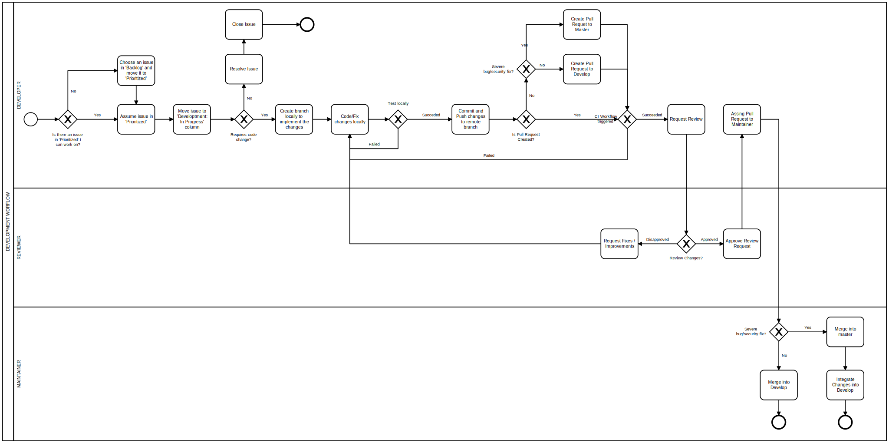
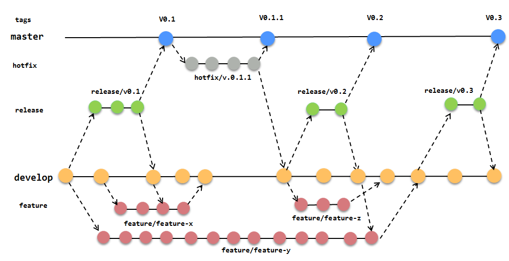

# Contribution Guidelines

## Filing issues
                            
Always try to use the issues templates to reports bug or request new features otherwise your issue could be closed. 

__Sensitive security-related issues should be reported via email__

## Development Workflow

## Issues Management (for Project Members)

To improve the management of the list of things to-do in the project it is used the kanban board from Github.

### Backlog

All issues created are placed in this column.

### Prioritized

The issues that have higher priority are moved from Backlog to this column. So developers that are looking for a new issue to work on, should always look at this column before Backlog.

### Development In Progress

When a developer starts working on an issue, he must move the issue to this column. 
The fixes or new features must be implement in a different branch in developers local environment and then a Pull Request must be used to merge the changes. After the changes are done and pushed to the remote repository on Github, the developer must assign at least one reviewer to the Pull Request. The issue will be automatically moved to the column Ready To Test.

### Ready To Test

When the reviewer is actually going to review the Pull Request, he must move the issue in this column to Testing.

### Testing

If the reviewer approve the Pull Request, then the Pull Request in this column will be moved automatically to Ready To Merge.

### Done

When the Pull Request is merged or closed, the issue and Pull Requests are moved automatically to this column. 

## Branch Protection Rules

* The branches master and develop are protected, so all changes to them, must be done through Pull Requests. 
* Tag branches are also protected and can not be changed.
* Pull Requests must be assign at least one reviewer.
* All pipelines must succeed for a Pull Request to be merged.
* Forced pushes are not allowed in protected branches

## Pull Requests

* In general all Pull Requests should target __develop__ branch.
* Always update the Readme instructions when applicable

**Git / Github Tutorials**
* http://try.github.io/
* https://guides.github.com/
* https://www.youtube.com/githubguides
* https://guides.github.com/introduction/flow

