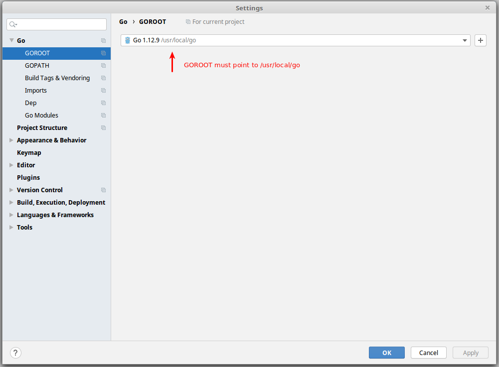
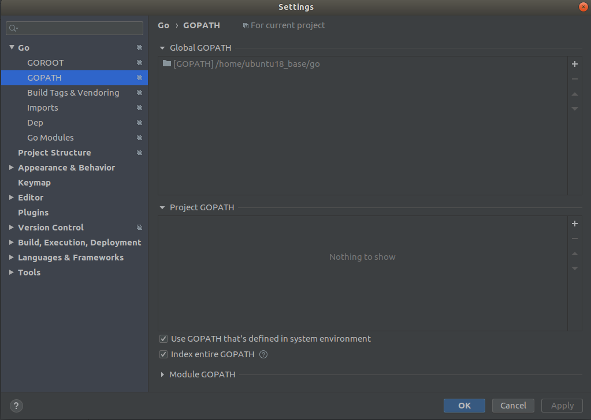
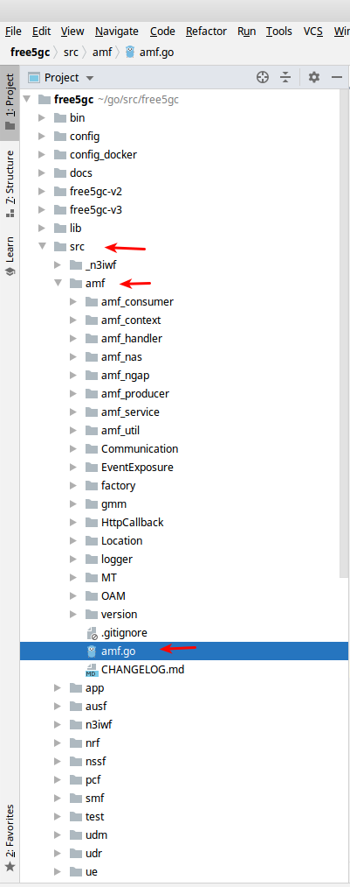
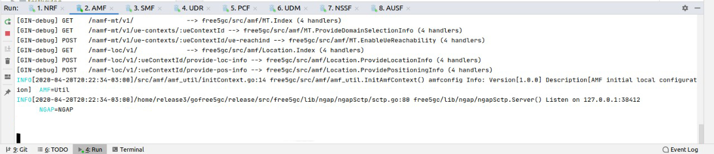
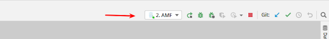
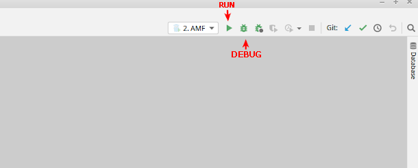
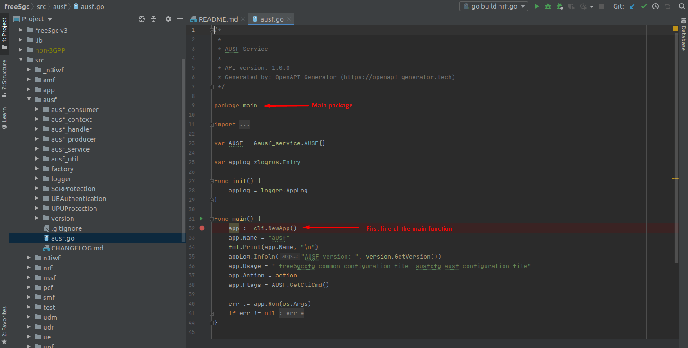

# Setting up development environment

## Installing useful tools

1. Before continue, follow the free5gc installation steps from [here](/readme.md)

2. Install some tools required to develop, monitor and containerize:

```
sudo apt update
```
```
sudo apt install tcpdump wireshark curl snap
```
```
curl -fsSL https://get.docker.com -o get-docker.sh && sudo sh get-docker.sh
```
```
sudo curl -L "https://github.com/docker/compose/releases/download/1.25.4/docker-compose-$(uname -s)-$(uname -m)" -o /usr/local/bin/docker-compose
sudo chmod +x /usr/local/bin/docker-compose && sudo ln -s /usr/local/bin/docker-compose /usr/bin/docker-compose

```
```
wget -q https://download.jetbrains.com/go/goland-2020.1.tar.gz
```
```
sudo snap install goland --classic
```

## Opening the project in GoLand

1. Open the project with GoLand 
    - The project folder should be `~/go/src/free5gc`

2. Check that **$GOPATH** and **$GOROOT** are recognized by GoLand and points to the right folders
    - Acess menus: File -> Settings
    - **$GOROOT** and **$GOPATH** should look like below:
    
    
    
    - **$GOPATH** should show your user instead of _ubuntu18_base_
    
    

3. Now, the IDE should be able to recognize the imports from external libraries and packages under `free5gc/src/`

## Running NF components in GoLand

1. On the Project View on the left, navigate through the component you want to run



2. Right click on the component (*.go) and choose RUN
    - Optional: Use the CTRL + F9 (shortcut)

3. After this, the run window will show




4. Now the “command” will be available on the toolbar



5. Next time just choose the command in the toolbar and run or debug clicking on the buttons



6. To stop a running or debugging component click the Stop button on the toolbar


Obs: Do the same for the other NF components. All the components are in `free5gc/src/{component}/{component}.go`. For example, SMF is in `free5gc/src/smf/smf.go`.

## Debugging

1. To start debugging some component since the beginning, you must set a breakpoint on the main function in the main package of the component.

    - For example, to start debugging the AUSF, set a breakpoint in the first line of code of the main function of the `free5gc/src/ausf/ausf.go` file.




## Steps to try out Ping

1. To setup development environment (With network interfaces and namespaces)
```
cd ~/go/src/free5gc
sudo ./setup_dev.sh up
```


2. Run the core (Runs UPF in namespace UPFns and other NFs in default namespace)
```
sudo ./run.sh
```


3. Run GoLand in UE namespace (Required to debug UE)
```
sudo ip netns exec UEns goland
# now you can debug the UE using the IDE
# on the running/debugging command you have to append the args --ping=5
# this args tells UE to run the ping routine
```


4. Monitor network traffic in UE with Wireshark
```
sudo ip netns exec UEns wireshark
# choose interface any
# useful filter to use in wireshark: ip.addr == 192.168.127.1 or ip.addr == 192.168.127.2 or ip.addr == 60.60.0.0/16 and !ssdp and !mdnp and !arp
```

5. Run UE on terminal
```
cd ~/src/go/free5gc
go build -o ./bin/ue -x src/ue/ue.go
sudo ip netns exec UEns ./bin/ue
```

6. To shutdown the interfaces and namespaces
```
cd ./go/src/free5gc/
sudo ./setup_dev.sh down
```
